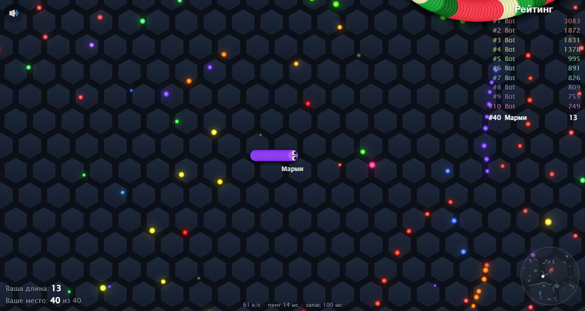
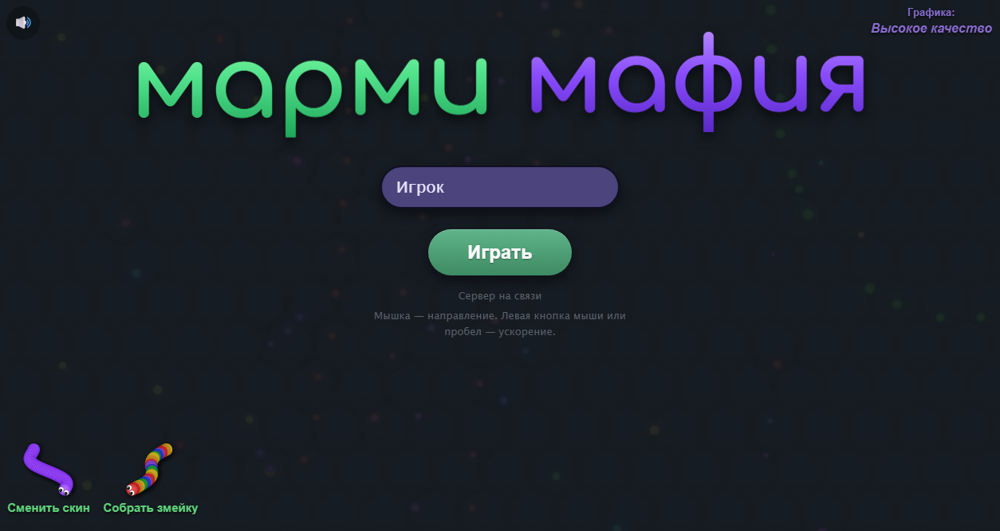
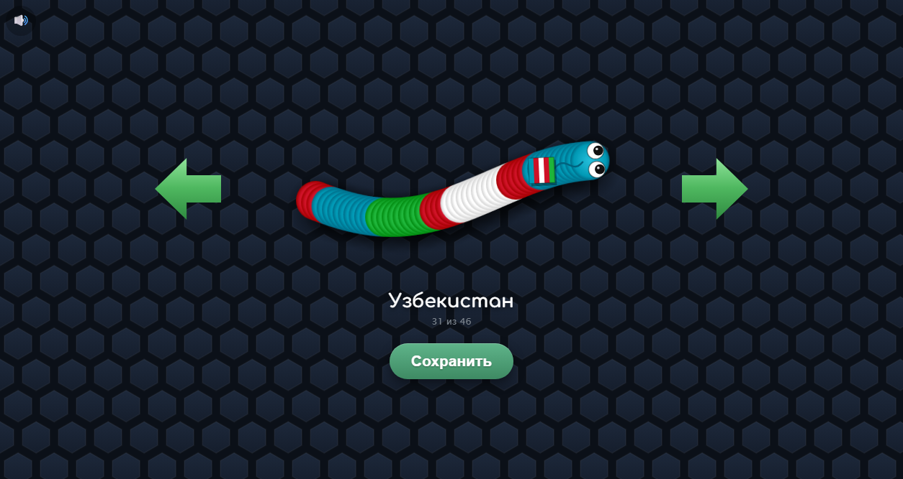
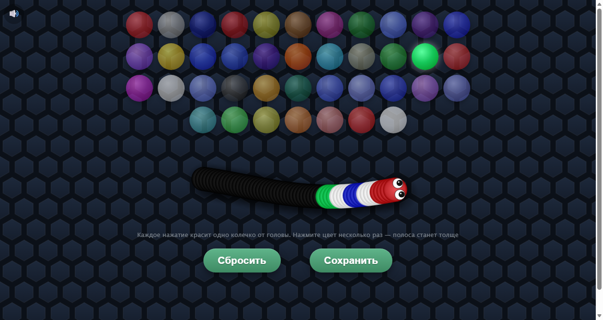
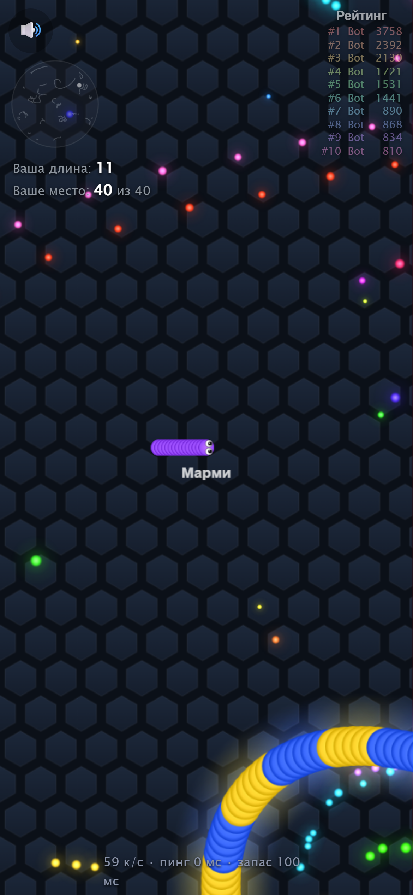

<div align="center">

# 🐍 Марми Мафия · Marmi Mafia

**Мультиплеерная змейка в браузере — играйте с друзьями прямо сейчас, без установки.**
**A multiplayer snake .io game for the browser — play with friends right now, no install.**

### [▶ ИГРАТЬ / PLAY — marmi-mafia.onrender.com](https://marmi-mafia.onrender.com)



</div>

---

## 🇷🇺 Что это

**Марми Мафия** — сетевая змейка в духе .io-игр. Все игроки ползают по одной общей карте, едят светящуюся еду, растут и подрезают друг друга. Пока друзья не зашли — на карте умные боты.

- 🌍 **Мультиплеер в реальном времени** — одна карта на всех, общий рейтинг топ-10
- 🤖 **Умные боты** — охотятся, подрезают под голову, обвивают мелких кольцом, дерутся за еду и берегут себя
- 🎨 **46 скинов** — флаги, неон, космос, циклоп, улитка на усиках и другие
- 🧩 **Конструктор «Собрать змейку»** — соберите свою раскраску из 40 цветов, её увидят все игроки
- 📱 **Работает на телефоне** — джойстик слева, ускорение справа
- ⚡ **Мгновенный отклик** — своя змейка поворачивает сразу, даже на мобильном интернете
- 🔊 **Мягкие звуки и музыка** — синтезируются в браузере, без файлов
- 🪶 **Лёгкая** — ~5 КБ/с трафика на игрока, плавно даже на слабых телефонах

**Управление.** Компьютер: мышка — направление, левая кнопка или пробел — ускорение (тратит длину). Телефон: левая половина экрана — джойстик, палец на правой половине — ускорение.

## 🇬🇧 About

**Marmi Mafia** is a real-time multiplayer snake game for the browser. Everyone shares one map: eat glowing orbs, grow longer, and cut in front of other snakes to make them crash. Smart bots keep the map alive when your friends aren't online.

- Real-time multiplayer on one shared map with a live top-10 leaderboard
- Smart bots that hunt, cut you off, encircle smaller snakes and avoid crashing
- 46 skins plus a **Build-a-Snake** editor (40 colors) that everyone sees
- Mobile-friendly: floating joystick on the left, boost on the right
- Client-side prediction for instant controls, even on mobile networks
- Lightweight: ~5 KB/s per player

## 📸 Скриншоты · Screenshots

| Меню · Menu | Скины · Skins |
|---|---|
|  |  |
| **Конструктор · Builder** | **Телефон · Phone** |
|  |  |

## 🛠 Запустить у себя · Run locally

Нужен [Node.js](https://nodejs.org) 18+.

```bash
git clone https://github.com/arsenalznakomstvo-wq/marmi-mafia.git
cd marmi-mafia
npm install
npm start
```

Откройте **http://localhost:7777**. Порт меняется переменной `PORT`.

**Как устроено:** сервер на Node.js (`server.js`, библиотека `ws`) ведёт общую карту 30 раз в секунду, считает ботов и столкновения и рассылает каждому игроку только то, что рядом с ним, в компактном двоичном формате. Браузер (`public/`) рисует картинку на Canvas, сглаживает движение между обновлениями и предсказывает свою змейку для мгновенного отклика.

---

<div align="center">

⭐ **Понравилось? Поставьте звезду — это очень помогает проекту!**
⭐ **Enjoyed it? Please star the repo — it really helps!**

*Фанатский проект, вдохновлённый жанром .io-игр. Не связан с авторами slither.io.*
*A fan project inspired by the .io game genre. Not affiliated with slither.io.*

</div>
